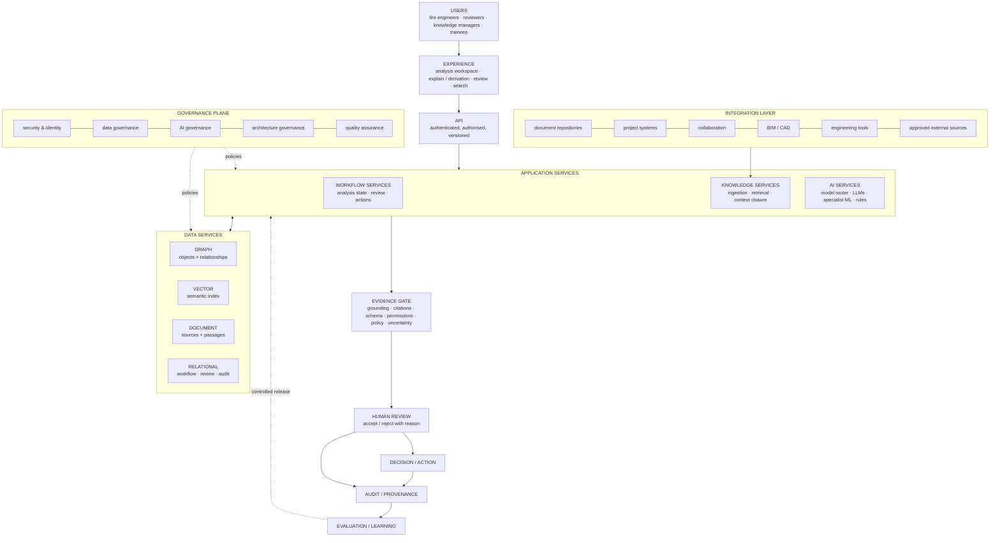

# Engineering Knowledge Intelligence Platform — Target Architecture

**Knowledge Fabric + Intelligence Layer + Engineering Workflow**

> **Status of this document.** This is a **target-state architecture hypothesis** for the
> problem described publicly for the BB7 × University of Leeds Knowledge Transfer Partnership.
> It is **not** BB7's internal architecture. **No BB7 internal system, data set, process or
> technology has been inspected**, and nothing here claims that BB7 uses any architecture,
> product or technology. Every technology choice below is a **hypothesis to be validated during
> KTP discovery**, collaboratively with BB7 and the University of Leeds.
>
> It sits alongside the implemented public demonstrator ([ARCHITECTURE.md](ARCHITECTURE.md)),
> which is a small vertical slice of this target, running on synthetic data.

---

## Contents

1. [Architecture thesis](#1-architecture-thesis)
2. [TOGAF-aligned domains and cross-cutting concerns](#2-togaf-aligned-domains-and-cross-cutting-concerns)
3. [Business architecture](#3-business-architecture)
4. [Data architecture](#4-data-architecture)
5. [Knowledge ingestion and data pipeline](#5-knowledge-ingestion-and-data-pipeline)
6. [Retrieval architecture](#6-retrieval-architecture)
7. [AI / ML architecture](#7-ai--ml-architecture)
8. [Deterministic + probabilistic + human architecture](#8-deterministic--probabilistic--human-architecture)
9. [Evidence Gate and AI assurance](#9-evidence-gate-and-ai-assurance)
10. [Workflow architecture](#10-workflow-architecture)
11. [Integration architecture](#11-integration-architecture)
12. [Security architecture](#12-security-architecture)
13. [Evaluation architecture](#13-evaluation-architecture)
14. [Learning loop](#14-learning-loop)
15. [Target-state diagram](#15-target-state-diagram)
16. [Architecture principles](#16-architecture-principles)

---

## 1. Architecture thesis

Engineering consultancies hold deep expertise, but much of it is **fragmented**: spread across
reports, strategies, calculations, drawings, correspondence, test evidence and the experience of
individual engineers. The difficulty is rarely finding *a* document; it is establishing **which
knowledge applies to this situation, on what evidence, and with what uncertainty**.

The thesis is that a knowledge platform for engineering must be three things working together,
not a chatbot over a document store:

```
KNOWLEDGE FABRIC          structured, contextualised, provenance-bearing engineering knowledge
        +
INTELLIGENCE LAYER        retrieval, reasoning and assurance over that knowledge
        +
ENGINEERING WORKFLOW      the professional process in which knowledge is used, reviewed and acted on
```

AI and large language models are **capabilities inside** the intelligence layer. They are not the
architecture, and they are not the system of record.

The value chain the platform exists to support:

```
Fragmented engineering knowledge
  → structured / contextualised knowledge
  → evidence-grounded retrieval
  → reasoning
  → human review
  → decision / action
  → learning
```

### Demonstrator, target and research — kept distinct

| | Current public demonstrator | Target enterprise architecture | Future research / implementation inside the KTP |
|---|---|---|---|
| Purpose | Show the pattern works end to end on one scenario | Describe the intended platform | Discover, validate, build and evaluate |
| Knowledge | 64 synthetic records, hand-authored corpus | Real engineering knowledge ingested with provenance | Which sources, what structure, what quality |
| Retrieval | Deterministic graph traversal only | Hybrid keyword + semantic + graph with context closure | Applicability modelling; retrieval evaluation |
| AI | Deterministic by default; optional bounded model interpretation | Model router over LLMs, specialist ML and rules | Which tasks benefit from which models, measured |
| Workflow | One analysis flow, session-scoped review | Stateful engineering workflow with accountable review | Fit to real consultancy practice |
| Identity / security | None (public, unauthenticated) | SSO, RBAC/ABAC, retrieval-time authorisation | Mapping to organisational permissions |
| Evaluation | Automated tests (146) and a live acceptance test | Permanent evaluation service with golden cases | Baselines, expert agreement, adoption |

Where this document says "the platform", it means the **target**. Where it refers to what exists
today, it says "the demonstrator".

---

## 2. TOGAF-aligned domains and cross-cutting concerns

The target is described using the four architecture domains of TOGAF (The Open Group
Architecture Framework). This is a structuring device for discussion, not a commitment to a
particular method or tool.

| Domain | Question it answers here | Sections |
|---|---|---|
| **Business Architecture** | What engineering capabilities and workflows does the platform serve? | [3](#3-business-architecture), [10](#10-workflow-architecture) |
| **Data Architecture** | What knowledge objects, relationships and provenance does it hold? | [4](#4-data-architecture), [5](#5-knowledge-ingestion-and-data-pipeline) |
| **Application Architecture** | Which services retrieve, reason, assure and orchestrate? | [6](#6-retrieval-architecture), [7](#7-ai--ml-architecture), [8](#8-deterministic--probabilistic--human-architecture), [9](#9-evidence-gate-and-ai-assurance), [11](#11-integration-architecture) |
| **Technology Architecture** | What platform services host and secure it? | [12](#12-security-architecture), [15](#15-target-state-diagram) |

### Cross-cutting concerns

| Concern | Target position |
|---|---|
| **Security** | Defence in depth; least privilege; encryption in transit and at rest; no data leaves approved boundaries. |
| **Identity** | Organisational single sign-on; every action attributable to an authenticated person or service identity. |
| **Data governance** | Ownership, classification, retention and quality rules per knowledge source; approved sources only. |
| **AI governance** | Approved models and uses; documented model cards and limits; human accountability for outcomes; change control on prompts, models and retrieval. |
| **Provenance** | Every knowledge object, finding and decision traceable to its sources, versions and derivation. |
| **Auditability** | Immutable record of analyses, evidence bundles, findings, reviews and releases. |
| **Architecture governance** | Principles (section 16), decision records, design authority, and explicit validation of each hypothesis during discovery. |
| **Quality assurance** | Continuous evaluation (section 13); release gates; regression suites of engineering cases. |

---

## 3. Business architecture

### Representative capabilities

These are **representative** capabilities for a fire-engineering knowledge platform, to be
confirmed and prioritised with practitioners during discovery.

| Capability | What it means |
|---|---|
| **Knowledge capture** | Bring engineering knowledge — reports, strategies, calculations, evidence, expert insight — into the fabric with its context. |
| **Knowledge classification** | Organise knowledge by domain, project, building characteristics, regulatory basis and type. |
| **Knowledge retrieval** | Find the knowledge relevant to a question or change, including precedent. |
| **Requirement interpretation** | Identify which requirements and guidance bear on a situation, and how. |
| **Evidence management** | Hold evidence with provenance, status, version and validity. |
| **Evidence applicability** | Establish whether evidence obtained in one context applies to another. |
| **Engineering reasoning** | Relate change, requirements, hazards and evidence into findings. |
| **Uncertainty assessment** | Make explicit what is unknown, assumed or not established. |
| **Human review** | Accountable engineers accept, reject or correct findings with reasons. |
| **Decision support** | Present options, consequences and evidence for a professional decision. |
| **Verification planning** | Define what must be verified, how, and against which criteria. |
| **Lessons learned** | Capture what a project taught, in reusable, contextualised form. |
| **Knowledge reuse** | Apply prior knowledge to new work — with its applicability tested, not assumed. |

### Representative end-to-end engineering workflow

```
Project / change
  → information gathering
  → context                    (building, occupancy, strategy, regulatory basis)
  → requirements               (what applies, and whether applicability is established)
  → evidence                   (what exists, where from, what status)
  → applicability              (does it transfer to this context?)
  → reasoning                  (findings, with derivation)
  → gaps                       (unknowns, missing or non-transferable evidence)
  → engineer review            (accept / reject / correct, with reasons)
  → decision / action
  → verification evidence
  → lessons learned            (fed back into the knowledge fabric)
```

The demonstrator implements a slice of this flow for one scenario (SCN-F01). Lessons learned and
knowledge capture are not implemented.

---

## 4. Data architecture

### Key abstraction: engineering knowledge objects + relationships

The fabric is organised around **engineering knowledge objects and the relationships between
them**, not around documents alone. A document is a *source*; the knowledge it contains —
a requirement, an assumption, a test result, the occupancy it was written for — becomes
addressable, relatable and reusable only when it is represented as objects with relationships and
provenance.

### Representative entities

| Entity | Role |
|---|---|
| Project | The engagement in which knowledge is created and used |
| Building | A building within a project |
| Level | A storey or level of a building |
| Space | A space or zone within a level |
| Occupancy | The use and occupant characteristics that condition applicability |
| Fire Strategy | The strategy and its design basis |
| Engineering Change | A proposed or actual change to design, use or condition |
| Requirement | An obligation or design objective, with its applicability status |
| Standard / Guidance | Legislation, statutory guidance or code of practice (by identifier) |
| Hazard / Failure Mode | What could go wrong, with consequence |
| Test | A verification activity, with its acceptance criterion if established |
| Test Result | The outcome of a test, in its context |
| Evidence | An item relied on, with provenance and validity |
| Finding | A derived statement with classification, confidence and derivation |
| Assumption | A premise not established by evidence, stated explicitly |
| Review Decision | An accountable accept / reject / correct with reason |
| Verification Action | What must be done to establish or re-establish evidence |

### Representative relationships

```
PROJECT      → contains      → BUILDING → LEVEL → SPACE
PROJECT      → has           → FIRE STRATEGY
PROJECT      → introduces    → CHANGE
CHANGE       → affects       → REQUIREMENT
REQUIREMENT  → derived_from  → STANDARD
REQUIREMENT  → supported_by  → EVIDENCE
REQUIREMENT  → verified_by   → TEST
TEST         → produces      → RESULT
```

Further relationships to validate in discovery include `SPACE → has → OCCUPANCY`,
`FINDING → cites → EVIDENCE`, `FINDING → assumes → ASSUMPTION`,
`REVIEW DECISION → decides → FINDING`, `FINDING → requires → VERIFICATION ACTION`, and
`EVIDENCE → obtained_under → OCCUPANCY / FIRE STRATEGY` (the basis for applicability).

### Provenance on every evidence object

Every evidence object retains, as data rather than as a footnote:

| Provenance attribute | Purpose |
|---|---|
| Source | The system or repository it came from |
| Version | The revision or version of the source |
| Location | Where in the source (document, page, section, record) |
| Date | When produced and when retrieved |
| Context | The conditions it was produced under (project, occupancy, strategy, configuration) |
| Extraction method | Manual, rule-based, or model-assisted — and which model/version |
| Confidence | How reliable the extraction and classification are |
| Verification state | Unverified, verified by a person, superseded, withdrawn |
| Access classification | Who may see it (drives retrieval-time authorisation) |

In the demonstrator, every record carries connector, source record, source file, retrieval time
and data classification, and applicability is tested by comparing a recorded basis
(`office` → `residential`). The target generalises this to real, versioned sources.

---

## 5. Knowledge ingestion and data pipeline

```
Sources
  → connectors                 read-only, permission-aware
  → raw landing                immutable copy + source metadata
  → extraction                 text, tables, drawings metadata
  → normalisation              units, identifiers, formats
  → classification             domain, type, project, regulatory basis
  → entity extraction          requirements, occupancies, tests, results, assumptions …
  → relationship extraction    affects, derived_from, supported_by, verified_by …
  → validation                 schema, reference integrity, human sampling
  → ┌ knowledge graph           objects + relationships
    ├ document store            source documents and passages
    └ vector index              embeddings of passages and objects
```

**Provenance is a first-class property of ingestion**, not something added later: each stage
records what it did, with which method or model version, and with what confidence. An extracted
object always points back to the exact source location and version it came from, and inherits the
source's access classification. Re-ingesting a new source version supersedes rather than silently
overwrites earlier objects.

Model-assisted extraction is treated as **proposals** until validated; validation rules and
sampling decide whether an extracted object may be relied on.

---

## 6. Retrieval architecture

### Hybrid retrieval

```
keyword retrieval          exact identifiers, clause references, terms of art
  +
semantic retrieval         meaning-level similarity over passages and objects
  +
graph traversal            relationships from the change to what it affects
  → candidate evidence
  → re-ranking              relevance, authority, recency, verification state
  → context closure         applicability conditions tested explicitly
  → evidence bundle         cited, provenance-bearing, permission-checked
```

### Semantic similarity does not establish engineering applicability

A passage about stair capacity in an office building is *semantically* close to a question about
stair capacity in a residential building. It may still be **inapplicable**, because the occupants,
their alertness and the evacuation strategy differ. Similarity finds candidates; it does not
decide relevance.

**Context closure** therefore tests candidate evidence against the material conditions of the
case, including:

- occupancy and occupant characteristics
- geometry and layout
- configuration and installed systems
- fire strategy and evacuation basis
- regulatory basis and edition of guidance
- assumptions the evidence rests on
- validity and version (superseded, withdrawn, current)
- other material conditions identified by the engineer

Evidence that fails closure is not discarded silently: it is reported as **not transferable**
with the reason, because knowing that existing evidence does not apply is itself a finding. The
demonstrator shows this with FTR-001 (a passing stair-capacity assessment obtained for office use).

---

## 7. AI / ML architecture

### AI services by function

| Service | Function | Typical approach (hypothesis) |
|---|---|---|
| Classification | Assign domain, type, project, basis | Specialist ML or LLM with schema |
| Entity extraction | Identify requirements, tests, occupancies, assumptions | LLM with schema + validation |
| Relationship extraction | Propose typed relationships | LLM with schema + graph validation |
| Semantic retrieval | Embed and match passages and objects | Embedding models |
| Summarisation | Condense evidence bundles, with citations | LLM, grounded |
| Requirement interpretation | Explain how a requirement bears on a case | LLM, grounded and gated |
| Applicability assistance | Surface conditions that may break transferability | LLM + rules over recorded context |
| Anomaly / gap detection | Missing, inconsistent or unsupported items | Rules + ML |
| Engineering synthesis | Draft findings across evidence | LLM, grounded and gated |
| Natural-language interaction | Questions and explanations in plain language | LLM over retrieved context |

### Model router

```
                    ┌───────────────────────────────┐
  task + context →  │          MODEL ROUTER          │  → result + model/version provenance
                    └──────┬──────────┬──────────┬───┘
                           │          │          │
             Claude / other LLMs   specialist ML   deterministic rules
             (interpretation,      (classification, (IDs, validation,
              synthesis)            ranking)         applicability tests)
```

- The router chooses the capability by **task, risk, cost and evaluated performance**.
- **The model provider is replaceable.** Models sit behind a provider-neutral interface; prompts,
  schemas and evaluation sets belong to the platform, not to a vendor.
- Every model output records which model and version produced it, so it can be evaluated,
  compared and rolled back.
- Where a deterministic rule can answer, it answers; a model is used where interpretation is
  genuinely required.

This is not a single-vendor architecture. Claude is one candidate LLM capability among others.

---

## 8. Deterministic + probabilistic + human architecture

| Deterministic | AI / ML (probabilistic) | Human |
|---|---|---|
| Identifiers | Interpretation | Professional judgement |
| Relationships | Extraction | Acceptance / rejection |
| Provenance | Semantic matching | Exceptions |
| Versioning | Synthesis | Escalation |
| Workflow state | | Accountability |
| Validation | | |
| Permissions | | |
| Review records | | |
| Audit | | |

Each part does what it is reliable at. Deterministic controls **constrain** probabilistic
reasoning; people **decide**.

```
Knowledge
  → Retrieval
  → Context                  (context closure)
  → AI + Rules               (interpretation and deterministic tests)
  → Evidence Gate            (assurance before anything is shown)
  → Engineering Finding      (classified, cited, with confidence and assumptions)
  → Human Review             (accept / reject with reason)
  → Decision / Action
```

---

## 9. Evidence Gate and AI assurance

Nothing an AI component produces reaches an engineer until it passes the **Evidence Gate**.

| Control | What it checks |
|---|---|
| **Grounding** | Each claim is supported by evidence in the bundle it was given. |
| **Citation verification** | Every cited object exists, is the version cited, and is in the bundle. |
| **Schema validation** | Outputs conform to the expected structure (finding, classification, citations, confidence). |
| **Unsupported claim detection** | Claims without verifiable support are removed or downgraded to *assumed*, with the assumption stated. |
| **Permission checks** | No output contains or depends on content the requesting user may not see. |
| **Safety / policy checks** | No invented acceptance criteria, limits or thresholds; no out-of-scope professional advice. |
| **Confidence / uncertainty** | Confidence derived from evidence properties; what is not established is reported as UNKNOWN. |

**The architecture does not rely on hidden chain-of-thought.** It provides **auditable
derivation** through evidence, relationships, rationale, confidence, assumptions and review
state — artefacts an engineer can inspect and challenge.

The demonstrator implements a first version of this gate (citation verification, unsupported-claim
downgrading, no invented criteria, UNKNOWN reporting); the live acceptance test resolved 100/100
citations with provenance ([LIVE-ACCEPTANCE-TEST.md](LIVE-ACCEPTANCE-TEST.md)).

---

## 10. Workflow architecture

An analysis is a stateful, auditable workflow, not a single request.

```
Create analysis
  → define change
  → affected domain
  → requirements
  → evidence
  → applicability
  → findings
  → gaps
  → human review
  → accept ─────────► action ─────┐
  → reject ─────────► hold ───────┤ (re-assess, then return to findings)
                                  ▼
                            verification
                                  ▼
                            close / learn
```

| State | Entry condition | Exit condition |
|---|---|---|
| Create analysis | Authorised user, project context | Change defined |
| Define change | Change described and classified | Affected domains identified |
| Affected domain | Traversal complete | Requirements identified |
| Requirements | Applicability recorded or marked unknown | Evidence retrieved |
| Evidence | Evidence bundle assembled | Applicability tested |
| Applicability | Context closure complete | Findings produced |
| Findings | Passed Evidence Gate | Gaps stated |
| Gaps | Unknowns and missing evidence explicit | Ready for review |
| Human review | Finding presented with derivation | Decision recorded with reason |
| Accept → action | Finding accepted | Action assigned |
| Reject → hold | Reason required | Re-assessment completed |
| Verification | Actions carried out, evidence recorded | Criteria met or escalated |
| Close / learn | Decision closed | Lessons captured to the fabric |

Every transition is recorded with actor, time and state. In the demonstrator, rejecting a finding
without a reason is blocked, and a rejection places dependent actions on hold.

---

## 11. Integration architecture

**This document does not assert which systems BB7 uses.** The following are **integration
categories to validate during discovery**:

| Category | Examples of the kind of source (not assertions) |
|---|---|
| Document repositories | Report and document libraries |
| Project systems | Project and job records |
| Collaboration platforms | Shared workspaces and correspondence stores |
| BIM / CAD | Building models and drawing metadata |
| Engineering tools | Calculation and modelling tool outputs |
| Approved external knowledge sources | Legislation, statutory guidance, licensed standards metadata |

All are accessed through a **connector layer**:

- read-only by default; no automatic write-back
- each connector declares capabilities, permissions and data classification
- connectors can be enabled or disabled without changing the intelligence layer
- source-system agnostic: swapping a source changes a connector, not the platform

The demonstrator uses one read-only connector over a synthetic corpus to exercise this contract.

---

## 12. Security architecture

```
Identity / SSO                 organisational identity; service identities for components
  → RBAC / ABAC                role- and attribute-based access
  → project permissions        who may see which project
  → document / evidence permissions   inherited from sources at ingestion
  → retrieval-time authorisation      applied on every query, before ranking
  → AI context boundary        only authorised content can enter a model context
```

**The model must never receive information the requesting user is not authorised to see.**

Consequences of that rule:

- permissions are enforced in retrieval, not filtered afterwards from generated text
- evidence bundles are built per user, per request
- caches, embeddings and summaries respect the permissions of their sources
- model providers are used under terms that exclude training on submitted content, subject to
  validation during discovery
- audit records show who asked what, what was retrieved, and what the model received

The demonstrator has **no** identity, authentication or authorisation; it is public and uses
synthetic data only.

---

## 13. Evaluation architecture

Evaluation is a **permanent capability**, not a pre-launch activity.

```
Golden engineering cases        expert-curated questions, changes and expected evidence
  → retrieval tests             did the right evidence come back?
  → reasoning tests             are findings correct, grounded and appropriately uncertain?
  → safety tests                no invented criteria, no leakage, correct abstention
  → evaluation engine           repeatable runs over versions of models, prompts, retrieval
  → scorecard                   metrics per release, per capability
  → controlled improvement / release
```

### Metrics

| Metric | Question |
|---|---|
| Retrieval precision / recall | Is relevant evidence found, and irrelevant evidence excluded? |
| Evidence coverage | Are the requirements in scope covered by evidence? |
| Groundedness | Are claims supported by the cited evidence? |
| Citation correctness | Do citations exist and say what is claimed? |
| Applicability accuracy | Are transferable / non-transferable judgements correct? |
| Unsupported-claim rate | How often does the gate remove or downgrade claims? |
| Abstention / escalation behaviour | Does the system say UNKNOWN or escalate when it should? |
| Expert agreement | Do engineers accept findings, and why not when they reject? |
| Time-to-find precedent | How long to find relevant prior work? |
| Onboarding time | How quickly can a new engineer become effective? |
| Adoption | Is it used in real work? |

**Return on investment should be measured from baselines established during the KTP**, not
asserted in advance. No ROI figures are claimed in this document.

---

## 14. Learning loop

```
Engineer review
  → accepted / rejected / corrected
  → structured feedback          reason, correction, affected evidence
  → evaluation set               curated into golden cases
  → model / retrieval improvement
  → offline validation           against the full evaluation suite
  → controlled release           versioned, reversible, approved
```

The platform **does not self-train in production**. Feedback improves the system only through
curation, offline validation and an approved release. Every release can be compared with, and
rolled back to, its predecessor.

---

## 15. Target-state diagram



Text equivalent:

```
USERS → EXPERIENCE → API
      → WORKFLOW / KNOWLEDGE / AI services
      ↔ GRAPH / VECTOR / DOCUMENT / RELATIONAL data services
      → EVIDENCE GATE → HUMAN REVIEW → DECISION / ACTION
      → AUDIT / PROVENANCE → EVALUATION / LEARNING ⇢ controlled release

INTEGRATION LAYER   connectors to document, project, collaboration, BIM/CAD, tools, external sources
GOVERNANCE PLANE    security & identity · data · AI · architecture governance · quality assurance
```

The storage services named are **logical**; whether they are separate products, one converged
store, or existing organisational platforms is a discovery question.

---

## 16. Architecture principles

1. **Business capability before technology.** Start from the engineering capability and workflow; choose technology to serve it.
2. **Knowledge is contextual, not merely searchable.** Knowledge carries the conditions under which it holds.
3. **Evidence provenance is first-class data.** Source, version, location, context, method and verification state are stored and queried, not footnoted.
4. **Semantic similarity does not establish applicability.** Relevance is decided by context closure, not by embedding distance.
5. **AI is a component, not the system of record.** The fabric and workflow records are authoritative; model outputs are proposals until gated and reviewed.
6. **Deterministic controls constrain probabilistic reasoning.** Identifiers, relationships, validation, permissions and the Evidence Gate bound what models can assert.
7. **UNKNOWN is a valid engineering outcome.** Not establishing something is reported as such, never filled with an assumption.
8. **Human judgement remains authoritative.** Accountable engineers decide; the platform supports and records.
9. **Security and permissions propagate into retrieval and AI context.** No model sees what the user may not.
10. **Evaluation is continuous and measurable.** Releases are gated by evaluation against engineering cases and baselines.
11. **Architecture should remain model-provider and source-system agnostic.** Providers and sources are replaceable behind stable interfaces.
12. **The public demonstrator is a vertical slice; the KTP validates the enterprise target.** This document is a hypothesis to test, not a specification to impose.

---

*See also:* [ARCHITECTURE.md](ARCHITECTURE.md) (implemented demonstrator) ·
[PROVENANCE.md](PROVENANCE.md) · [LIMITATIONS.md](LIMITATIONS.md) ·
[LIVE-ACCEPTANCE-TEST.md](LIVE-ACCEPTANCE-TEST.md)
