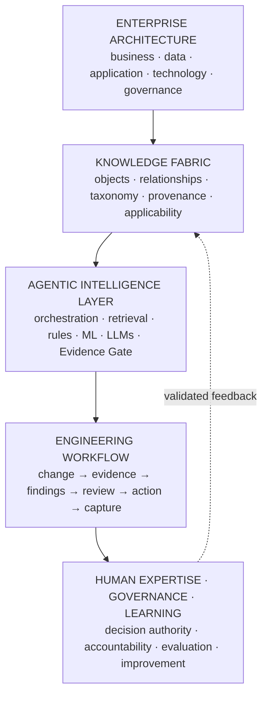
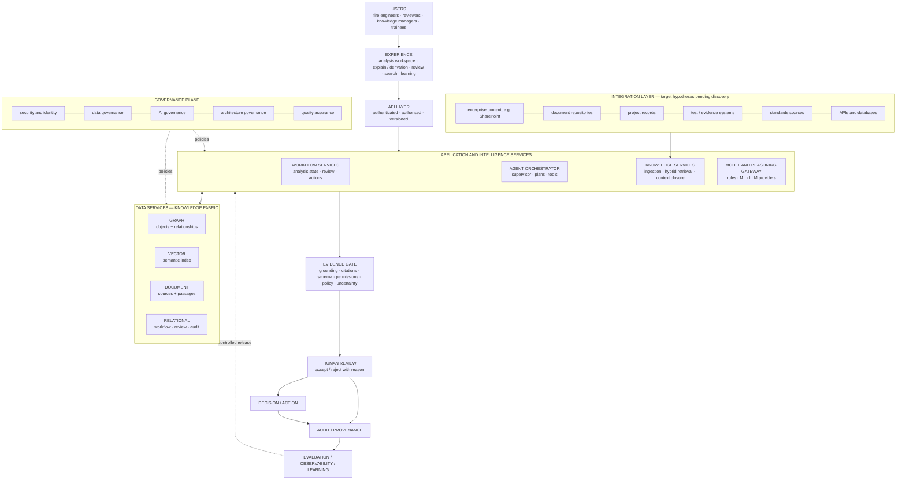
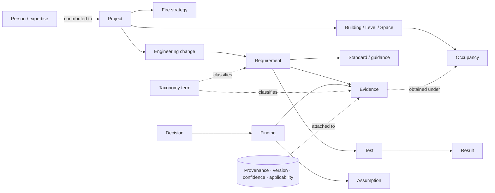
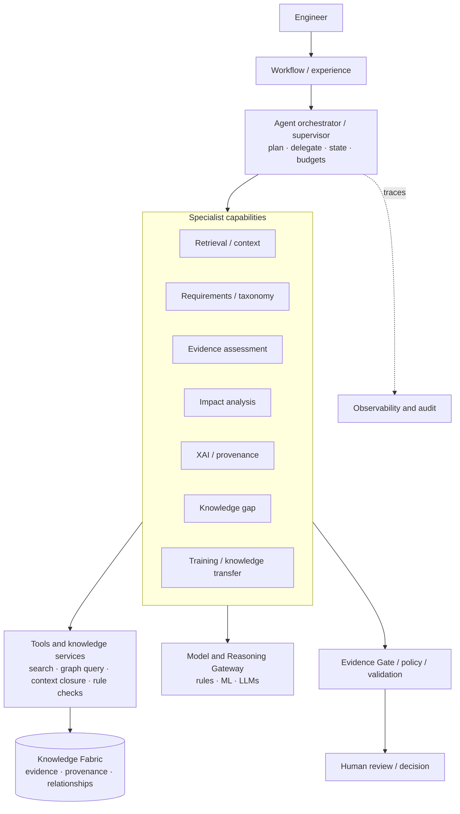
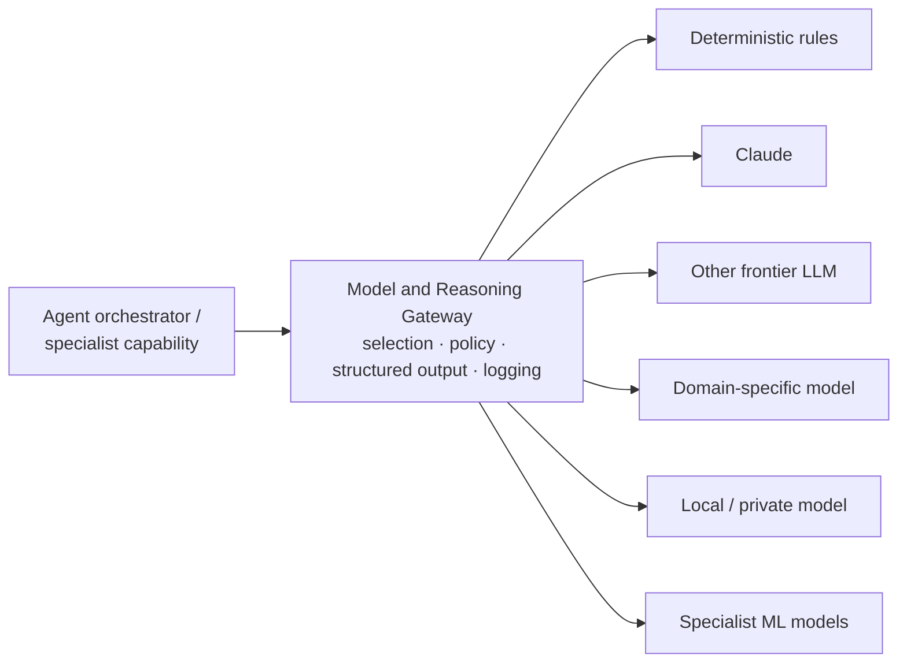
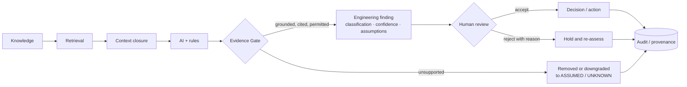
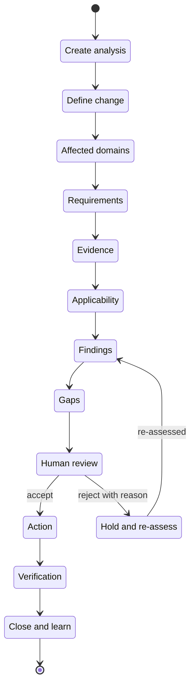

# Engineering Knowledge Intelligence Platform — Target Architecture

**Knowledge Fabric + Agentic Intelligence Layer + Engineering Workflow**

> **Status of this document.** This is a **target-state architecture hypothesis** for the
> problem described publicly for the BB7 × University of Leeds Knowledge Transfer Partnership
> (KTP). It is **not** BB7's internal architecture. **No BB7 internal system, data set, process or
> technology has been inspected or accessed**, and nothing here claims that BB7 uses, has
> commissioned, endorsed or approved any architecture, product or technology. Every technology
> choice is a **hypothesis to be validated during KTP discovery**, collaboratively with BB7 and the
> University of Leeds.
>
> The implemented public demonstrator ([ARCHITECTURE.md](ARCHITECTURE.md)) is a small **vertical
> slice** of this target. It runs on synthetic, public-safe data, is not production software and
> carries no safety certification.

---

## Contents

1. [Architecture thesis](#1-architecture-thesis)
2. [How the three architectural dimensions fit together](#2-how-the-three-architectural-dimensions-fit-together)
3. [Target-state overview](#3-target-state-overview)
4. [Business architecture](#4-business-architecture)
5. [Data architecture — the Knowledge Fabric](#5-data-architecture--the-knowledge-fabric)
6. [Knowledge ingestion and enterprise RAG](#6-knowledge-ingestion-and-enterprise-rag)
7. [Agentic Intelligence Architecture](#7-agentic-intelligence-architecture)
8. [Model and Reasoning Gateway](#8-model-and-reasoning-gateway)
9. [Evidence Gate, guardrails and human governance](#9-evidence-gate-guardrails-and-human-governance)
10. [Explainability and source attribution](#10-explainability-and-source-attribution)
11. [Engineering workflow architecture](#11-engineering-workflow-architecture)
12. [Knowledge management and training](#12-knowledge-management-and-training)
13. [Application and integration architecture](#13-application-and-integration-architecture)
14. [Technology architecture](#14-technology-architecture)
15. [Security, data governance and regulatory awareness](#15-security-data-governance-and-regulatory-awareness)
16. [Evaluation and observability](#16-evaluation-and-observability)
17. [Learning loop](#17-learning-loop)
18. [Architecture lifecycle and KTP delivery](#18-architecture-lifecycle-and-ktp-delivery)
19. [Current implementation mapping](#19-current-implementation-mapping)
20. [Architecture-to-KTP requirement traceability](#20-architecture-to-ktp-requirement-traceability)
21. [Research and innovation agenda](#21-research-and-innovation-agenda)
22. [Architecture principles](#22-architecture-principles)

---

## 1. Architecture thesis

Engineering consultancies hold deep, safety-relevant expertise, but much of it is **fragmented**:
across reports, fire strategies, calculations, drawings, correspondence, test evidence, standards
and the experience of individual engineers. The hard problem is rarely finding *a* document. It is
establishing **which knowledge applies to this situation, on what evidence, with what
uncertainty — and being able to show why**.

**The target system is not an AI chatbot.** It is an organisational engineering knowledge system
that lets people:

```
Store → Find → Connect → Explain → Decide
```

and, for engineering work, supports the full chain:

```
Engineering change
  → applicable knowledge
  → requirements
  → evidence
  → relationships
  → impact
  → uncertainty / gaps
  → auditable explanation
  → human decision
  → verification / action
  → knowledge capture
```

It does so as three layers working together:

| Layer | What it is | What it is not |
|---|---|---|
| **Knowledge Fabric** | Structured, contextualised, provenance-bearing engineering knowledge: objects, relationships, taxonomy, versions, applicability | A document dump or a vector database |
| **Agentic Intelligence Layer** | Orchestrated retrieval, deterministic reasoning, ML and LLM capabilities, assured by an Evidence Gate | The system of record, or an autonomous decision-maker |
| **Engineering Workflow** | The professional process in which knowledge is used, reviewed, decided on and captured | A chat window |

AI, large language models and agents are **controlled mechanisms inside** this architecture. The
Knowledge Fabric and its evidence and provenance are authoritative; human experts retain decision
authority for safety-critical conclusions.

### Demonstrator, target and research — kept distinct

| | **Current** — public demonstrator | **Target** — enterprise architecture | **Research** — inside the KTP |
|---|---|---|---|
| Purpose | Show the pattern works end to end on one scenario | Describe the intended platform | Discover, co-design, build, pilot and evaluate |
| Knowledge | 64 synthetic records, hand-authored corpus | Organisational engineering knowledge ingested with provenance | Which sources, what structure, what quality, what taxonomy |
| Retrieval | Deterministic graph traversal with context closure | Hybrid keyword + semantic + graph retrieval with context closure | Applicability modelling; retrieval evaluation |
| Intelligence | Bounded, acyclic pipeline of specialists; deterministic by default; optional bounded model interpretation | Supervisor-orchestrated capabilities and agents, least autonomy necessary | Where agents measurably improve workflows |
| Models | Provider-neutral interface (deterministic, Anthropic, LiteLLM) | Model and Reasoning Gateway over frontier, domain and private models | Which tasks benefit from which models, measured |
| Workflow | One analysis flow; session-scoped, unauthenticated review | Stateful engineering workflow with accountable, authenticated review | Fit to consultancy practice; adoption |
| Security | None (public, synthetic data) | SSO, RBAC/ABAC, retrieval-time authorisation | Mapping to organisational permissions and governance |
| Evaluation | 146 automated tests; live acceptance test | Permanent evaluation and observability service | Baselines, expert agreement, trustworthiness, publication |

---

## 2. How the three architectural dimensions fit together

This architecture is **not** "TOGAF with Claude added". Three complementary disciplines each do a
different job:

| Dimension | Role in this architecture |
|---|---|
| **Enterprise architecture (TOGAF-aligned)** | The **discipline**: business, data, application and technology architecture; governance; security; integration; lifecycle; principles. |
| **Agentic / frontier-AI architecture** | The **mechanism**: orchestration, specialist capabilities, tools, retrieval, context assembly, model routing, structured outputs, guardrails, evaluation, observability. |
| **BB7 KTP requirements** | The **requirements**: a knowledge management and training platform for fire engineering using explainable AI and machine learning, with source attribution, reasoning pathways, safety-critical reliability, stakeholder engagement, pilot, adoption and research. |

The architecture is derived top-down from the business problem:



TOGAF (The Open Group Architecture Framework) is used as a structuring discipline for discussion,
not as a commitment to a particular method, tool or certification.

---

## 3. Target-state overview



Storage services are **logical**. Whether they are separate products, a converged store, or
existing organisational platforms is a discovery question.

### TOGAF-aligned domains and cross-cutting concerns

| Domain | Question it answers | Sections |
|---|---|---|
| **Business Architecture** | Which engineering, knowledge-management and training capabilities are served? | [4](#4-business-architecture), [11](#11-engineering-workflow-architecture), [12](#12-knowledge-management-and-training), [18](#18-architecture-lifecycle-and-ktp-delivery) |
| **Data Architecture** | Which knowledge objects, relationships, taxonomy and provenance are held? | [5](#5-data-architecture--the-knowledge-fabric), [6](#6-knowledge-ingestion-and-enterprise-rag) |
| **Application Architecture** | Which services retrieve, orchestrate, reason, assure and explain? | [7](#7-agentic-intelligence-architecture), [8](#8-model-and-reasoning-gateway), [9](#9-evidence-gate-guardrails-and-human-governance), [10](#10-explainability-and-source-attribution), [13](#13-application-and-integration-architecture) |
| **Technology Architecture** | Which platform, cloud, API, database and observability services host it? | [14](#14-technology-architecture), [16](#16-evaluation-and-observability) |

| Cross-cutting concern | Target position |
|---|---|
| Security | Defence in depth; least privilege; encryption in transit and at rest; approved data boundaries only. |
| Identity | Organisational single sign-on; every action attributable to an authenticated person or service identity. |
| Data governance | Ownership, classification, retention, quality and lawful basis per knowledge source. |
| AI governance | Approved models and uses; model and prompt change control; documented limits; human accountability. |
| Provenance | Every knowledge object, finding and decision traceable to sources, versions and derivation. |
| Auditability | Immutable record of analyses, evidence bundles, agent steps, findings, reviews and releases. |
| Architecture governance | Principles, decision records, design authority, and explicit validation of each hypothesis. |
| Quality assurance | Continuous evaluation, release gates and regression suites of engineering cases. |

---

## 4. Business architecture

### Stakeholders (representative, to be confirmed in discovery)

| Stakeholder | Interest |
|---|---|
| Fire engineers | Find applicable knowledge and evidence quickly; trustworthy, explainable support |
| Senior / reviewing engineers | Accountable review; consistency; visibility of assumptions and gaps |
| Knowledge managers | Capture, taxonomy, quality and reuse of organisational knowledge |
| New and developing engineers | Learning from worked, evidenced examples; faster onboarding |
| Practice and business leadership | Quality, risk, efficiency, adoption and return on investment |
| IT, security and data protection | Integration, permissions, governance, compliance |
| Academic partners | Rigorous methods, evaluation and publishable research |

### Representative capabilities

| Capability | What it means |
|---|---|
| Knowledge capture | Bring reports, strategies, calculations, evidence and expert insight into the fabric with context |
| Knowledge classification | Organise knowledge by domain, project, building characteristics, regulatory basis and type |
| Taxonomy management | Maintain a controlled fire-engineering taxonomy / ontology used consistently across the fabric |
| Knowledge ecosystem mapping | Understand where knowledge lives, who holds it and how it connects |
| Expert discovery | Find who has relevant experience, through projects and contributions |
| Knowledge retrieval | Find knowledge relevant to a question or change, including precedent |
| Requirement interpretation | Identify which requirements and guidance bear on a situation, and how |
| Evidence management | Hold evidence with provenance, status, version and validity |
| Evidence applicability | Establish whether evidence obtained in one context applies to another |
| Engineering reasoning | Relate change, requirements, hazards and evidence into findings |
| Uncertainty assessment | Make explicit what is unknown, assumed or not established |
| Human review | Accountable engineers accept, reject or correct findings with reasons |
| Decision support | Present consequences, evidence and gaps for a professional decision |
| Verification planning | Define what must be verified, how, and against which criteria |
| Training and knowledge transfer | Turn reviewed knowledge into learning material and guided practice |
| Lessons learned | Capture what a project taught, in reusable, contextualised form |
| Knowledge reuse | Apply prior knowledge to new work, with applicability tested, not assumed |

### Representative end-to-end engineering workflow

```
Project / change
  → information gathering
  → context                    building, occupancy, strategy, regulatory basis
  → requirements               what applies, and whether applicability is established
  → evidence                   what exists, where from, what status
  → applicability              does it transfer to this context?
  → reasoning                  findings, with derivation
  → gaps                       unknowns, missing or non-transferable evidence
  → engineer review            accept / reject / correct, with reasons
  → decision / action
  → verification evidence
  → lessons learned            captured back into the Knowledge Fabric and training material
```

The demonstrator implements a slice of this flow for one scenario (SCN-F01). Knowledge capture,
lessons learned, expert discovery and training are **target** capabilities.

---

## 5. Data architecture — the Knowledge Fabric

### Not a document repository

The Knowledge Fabric is organised around **engineering knowledge objects and the relationships
between them**. A document is a *source*; the knowledge it contains — a requirement, an
assumption, a test result, the occupancy it was written for, the engineer who wrote it — becomes
findable, connectable, explainable and reusable only when represented as objects with
relationships, taxonomy and provenance.

### What the fabric represents

| Group | Knowledge objects and properties |
|---|---|
| Sources | Documents · Standards / guidance · Project records |
| Engineering context | Projects · Buildings · Levels · Spaces · Occupancy · Fire strategy · Systems · Components · Engineering change |
| Engineering knowledge | Requirements · Hazards / failure modes · Tests · Results · Evidence · Findings · Assumptions · Decisions · Verification actions |
| People | People / expertise · roles · contributions (subject to data protection) |
| Organisation of knowledge | Taxonomy / ontology terms · Relationships |
| Epistemic properties | Applicability · Version · Provenance · Confidence · Knowledge gaps |

Representative relationships:

```
PROJECT      → contains      → BUILDING → LEVEL → SPACE
SPACE        → has           → OCCUPANCY
PROJECT      → has           → FIRE STRATEGY
PROJECT      → introduces    → CHANGE
CHANGE       → affects       → REQUIREMENT · SYSTEM · COMPONENT
REQUIREMENT  → derived_from  → STANDARD
REQUIREMENT  → supported_by  → EVIDENCE
REQUIREMENT  → verified_by   → TEST
TEST         → produces      → RESULT
EVIDENCE     → obtained_under → OCCUPANCY / FIRE STRATEGY / CONFIGURATION
FINDING      → cites         → EVIDENCE
FINDING      → assumes       → ASSUMPTION
DECISION     → decides       → FINDING
PERSON       → contributed_to → PROJECT / EVIDENCE
ANY OBJECT   → classified_as → TAXONOMY TERM
```



### Taxonomy and ontology

A **controlled fire-engineering taxonomy** (for example: domains such as means of escape,
detection and alarm, compartmentation, suppression, smoke control, structural fire performance,
firefighting access, and regulatory basis) is used consistently for classification, retrieval,
expert discovery and training. It is co-designed with engineers, versioned, and governed; model
extraction proposes terms but does not change the taxonomy on its own. The demonstrator uses a
small version of this idea (`domain_areas` on records and a nine-domain view).

### Provenance on every evidence object

| Attribute | Purpose |
|---|---|
| Source | The system or repository it came from |
| Version | The revision of the source |
| Location | Where in the source (document, page, section, record) |
| Date | When produced and when retrieved |
| Context | Conditions produced under: project, occupancy, strategy, configuration |
| Extraction method | Manual, rule-based or model-assisted — and which model and version |
| Confidence | Reliability of extraction and classification |
| Verification state | Unverified, verified by a person, superseded, withdrawn |
| Access classification | Who may see it; drives retrieval-time authorisation |

### What relationships enable

| Capability | Enabled by |
|---|---|
| Knowledge ecosystem mapping | Graph of sources, projects, topics and people |
| Expert discovery | Person → contribution → project / evidence / taxonomy relationships |
| Impact analysis | Traversal from a change to requirements, systems and evidence |
| Evidence reuse | Evidence with context and applicability, not just text |
| Traceability | Requirement → test → result → evidence → finding → decision |
| Knowledge transfer and training | Reviewed findings with derivation as worked examples |
| Organisational learning | Decisions and lessons linked back to the knowledge they changed |

---

## 6. Knowledge ingestion and enterprise RAG

### Enterprise RAG is not "vector database + LLM"

Retrieval-augmented generation for engineering must retrieve **applicable, attributable evidence**,
not merely similar text. The target combines structured entities, graph relationships, metadata,
taxonomy, document and passage retrieval, semantic retrieval, keyword retrieval, relationship and
context traversal, provenance, versioning, applicability, confidence and evidence lineage.

### Pipeline

```
source
  → ingestion                  read-only, permission-aware connectors; immutable raw landing
  → classification             domain, type, project, regulatory basis, taxonomy terms
  → extraction                 text, tables, drawing metadata; entities proposed
  → entity resolution          one requirement, project or person — not five spellings of it
  → taxonomy                   controlled terms applied and validated
  → relationships              affects, derived_from, supported_by, verified_by, obtained_under …
  → indexing                   graph + document store + vector index + keyword index
  → retrieval                  hybrid: keyword + semantic + graph traversal
  → context closure            applicability conditions tested explicitly
  → reasoning                  rules, ML and LLM capabilities over the evidence bundle
  → provenance                 every step, method, model version and confidence recorded
  → human validation           sampling, review and correction before reliance
```

**Provenance is a first-class property of ingestion.** Each extracted object points to its exact
source location and version, inherits the source's access classification, and records the
extraction method. Model-assisted extraction produces **proposals** until validated. New source
versions supersede, rather than silently overwrite, earlier objects.

### Candidate enterprise sources — target integration hypotheses

The following are **hypotheses pending discovery**. This document does not assert which systems BB7
uses or how they are configured.

| Candidate source category | Examples of the kind of source |
|---|---|
| Enterprise content platforms | SharePoint or similar collaboration and document platforms |
| Document repositories | Report, strategy and calculation libraries |
| Project records | Project and job systems and their metadata |
| Standards and guidance | Licensed standards metadata; legislation and statutory guidance |
| Engineering reports | Fire strategies, assessments, technical notes |
| Test and evidence systems | Test certificates, inspection and commissioning records |
| APIs and databases | Existing organisational data services |

### Hybrid retrieval and context closure

```
keyword retrieval          identifiers, clause references, terms of art
  + semantic retrieval     meaning-level similarity over passages and objects
  + graph traversal        relationships from the change to what it affects
  → candidate evidence
  → re-ranking             relevance, authority, recency, verification state
  → context closure         applicability tested against material conditions
  → evidence bundle         cited, provenance-bearing, permission-checked
```

**Semantic similarity does not establish engineering applicability.** A stair-capacity assessment
for an office is semantically close to one for flats, yet may not apply because occupants,
alertness and evacuation strategy differ. Context closure tests candidates against occupancy,
geometry, configuration, fire strategy, regulatory basis and edition, assumptions, validity and
version, and other material conditions. Evidence that fails closure is reported as **not
transferable**, with the reason — itself a finding. The demonstrator shows this with FTR-001.

---

## 7. Agentic Intelligence Architecture

### Conceptual architecture

```
USER / ENGINEER
       ↓
WORKFLOW / EXPERIENCE
       ↓
AGENT ORCHESTRATOR / SUPERVISOR          plans, delegates, tracks state, enforces budgets
       ↓
┌──────────────────────────────────────────┐
│ Specialist capabilities                  │
│                                          │
│ Retrieval / Context Agent                │
│ Requirements / Taxonomy Agent            │
│ Evidence Assessment Agent                │
│ Impact Analysis Agent                    │
│ XAI / Provenance Agent                   │
│ Knowledge Gap Agent                      │
│ Training / Knowledge Transfer Agent      │
└──────────────────────────────────────────┘
       ↓
TOOLS + KNOWLEDGE SERVICES                search, graph query, closure, rule checks, writers
       ↓
KNOWLEDGE FABRIC
       ↓
Evidence / provenance / relationships
       ↓
DETERMINISTIC RULES + AI/ML + LLM         via the Model and Reasoning Gateway
       ↓
EVIDENCE GATE / POLICY / VALIDATION
       ↓
HUMAN REVIEW / DECISION
```



"Agent" here names a **capability boundary**, not a commitment that each capability is an
autonomous LLM agent. Most specialist capabilities are expected to be deterministic services or
bounded model calls; genuine agentic behaviour is reserved for tasks that need it.

| Capability | Responsibility | Likely mechanism (hypothesis) |
|---|---|---|
| Retrieval / Context | Assemble the evidence bundle; run context closure | Deterministic retrieval + graph traversal; LLM query reformulation where useful |
| Requirements / Taxonomy | Identify applicable requirements; classify against the taxonomy | Rules + ML classification; LLM interpretation, gated |
| Evidence Assessment | Status, criteria, transferability of evidence | Deterministic comparison of recorded conditions; LLM assistance on unstructured conditions |
| Impact Analysis | Domains and requirements reached by a change | Deterministic graph traversal |
| XAI / Provenance | Build the auditable derivation for each finding | Deterministic assembly from recorded artefacts |
| Knowledge Gap | Unknowns, missing criteria, missing evidence | Deterministic rules; ML anomaly detection |
| Training / Knowledge Transfer | Turn reviewed findings into learning material | LLM drafting, grounded and reviewed by people |

### Choosing the mechanism: least autonomy necessary

| Mechanism | Use when | Examples |
|---|---|---|
| **Deterministic services** | The answer follows from data and rules | IDs, traversal, applicability comparison, permissions, workflow state, validation |
| **ML models** | Statistical inference is appropriate and measurable | Classification, ranking, entity resolution, anomaly detection |
| **LLM reasoning** | Language or semantic interpretation adds value | Interpreting unstructured requirements, extraction, grounded summaries |
| **Agentic orchestration** | Multi-step planning, tool use, delegation or iteration materially improves the workflow | Investigating a complex change across many sources; assembling a training case |
| **Human judgement** | Professional, safety-critical or accountable decisions | Accepting findings, exceptions, escalation, sign-off |

Design rule: **use the least autonomous mechanism that reliably solves the task.** Deterministic
logic where it is sufficient; ML where statistical inference fits; LLMs where language reasoning is
valuable; agents only where multi-step behaviour earns its cost and risk. **Human experts retain
decision authority for safety-critical conclusions.**

### Controls on agentic behaviour

- **Supervisor owns state.** Agents do not converse freely with each other; the supervisor
  delegates, collects results and records the plan.
- **Bounded execution.** Step, time, tool-call and cost budgets; exceeding a budget is a reported
  outcome, not a silent retry loop.
- **Tool allow-lists and least privilege.** Each capability can call only the tools it needs, with
  the requesting user's permissions.
- **Structured outputs.** Capabilities return schema-validated findings (statement,
  classification, citations, confidence, assumptions, unknowns), not free text.
- **Evidence is data, never instruction.** Retrieved content is passed as untrusted context;
  prompt-injection in sources cannot change tools, permissions or policy.
- **Everything passes the Evidence Gate** before reaching a person.
- **Everything is traced** (section 16): plans, tool calls, model calls, inputs and outputs.

The current demonstrator deliberately has **no** agent loops: an acyclic `OrchestrationPipeline`
runs fixed stages and a selected set of specialists. It is the deterministic foundation the target
agentic layer would build on.

---

## 8. Model and Reasoning Gateway



The gateway selects a mechanism for each task using:

| Criterion | Why it matters |
|---|---|
| Task and capability | Some tasks need no model; others need strong language reasoning |
| Evaluation performance | Chosen on measured results on engineering cases, not reputation |
| Data sensitivity | Sensitive content may require private or local deployment |
| Reliability | Consistency, structured-output adherence, refusal and abstention behaviour |
| Latency | Interactive work versus batch ingestion |
| Cost | Per-task cost at realistic volumes |
| Deployment constraints | Regionality, contractual terms, organisational policy |

Position on providers:

- **Claude is a candidate frontier-model provider**, alongside other frontier LLMs,
  domain-specific models and local or private models where appropriate.
- **The model layer is replaceable.** Prompts, schemas, evaluation sets, taxonomy and knowledge
  belong to the platform, not to a vendor. Changing provider is a gateway configuration and
  evaluation exercise, not a redesign.
- **The model is not the system of record.** The Knowledge Fabric, evidence, provenance, workflow
  and review records are authoritative. Model outputs are proposals until gated and reviewed.
- Every model output records provider, model, version and parameters for evaluation, comparison
  and rollback.

The demonstrator already follows this pattern at small scale: `ModelProvider` is a provider-neutral
interface with `DeterministicProvider` (the default, no model), `AnthropicProvider` and
`LiteLLMProvider`, selected by configuration through `build_provider`. Credentials are referenced by
environment variable name only.

---

## 9. Evidence Gate, guardrails and human governance

### Deterministic + probabilistic + human

| Deterministic | AI / ML (probabilistic) | Human |
|---|---|---|
| Identifiers · relationships · provenance · versioning | Interpretation | Professional judgement |
| Workflow state · validation · permissions | Extraction | Acceptance / rejection |
| Review records · audit | Semantic matching | Exceptions and escalation |
| Policy enforcement | Synthesis | Accountability |

Deterministic controls **constrain** probabilistic reasoning; people **decide**.



### Evidence Gate controls

| Control | What it checks |
|---|---|
| Grounding | Each claim is supported by evidence in its bundle |
| Citation verification | Every cited object exists, is the version cited, and is in the bundle |
| Schema validation | Outputs conform to the finding schema |
| Unsupported claim detection | Unsupported claims are removed or downgraded to ASSUMED, with the assumption stated |
| Permission checks | No output contains or depends on content the user may not see |
| Safety / policy checks | No invented acceptance criteria, limits or thresholds; no out-of-scope professional advice |
| Confidence / uncertainty | Confidence derived from evidence properties; what is not established is UNKNOWN |

**Fail safe.** When evidence is insufficient, the system returns UNKNOWN or escalates; it does not
manufacture confidence. The demonstrator's insufficient-evidence guard returns a successful
"insufficient evidence" result rather than an answer for a subject that is not in the context.

---

## 10. Explainability and source attribution

Explainability here means **auditable derivation**, not narrative plausibility.

**The architecture does not rely on hidden chain-of-thought.** It exposes, for every material
finding, the artefacts an engineer can inspect and challenge:

| Element | Content |
|---|---|
| Finding | Statement, identifier, classification (FACT / DERIVED / INFERRED / ASSUMED / UNKNOWN) |
| Source attribution | Each cited evidence object with source, version, location and retrieval time |
| Reasoning pathway | Relationship paths from the change to each record relied on |
| Derivation | The rule, comparison or model step that produced the finding, and by whom or what |
| Confidence | Score and its basis in evidence properties — not model self-report |
| Assumptions and unknowns | What was assumed, and what could not be established |
| Gate outcome | Whether the finding passed, was downgraded, or had citations removed |
| Review state | Who accepted or rejected it, when, and why |

Every material AI-derived conclusion is attributable to **evidence, a rule, a model output or an
explicit assumption**. The demonstrator implements this as the *Auditable derivation* view
(`service.explain`), which the live acceptance test exercised for 26 findings and 100 citations.

---

## 11. Engineering workflow architecture



| State | Entry condition | Exit condition |
|---|---|---|
| Create analysis | Authorised user, project context | Change defined |
| Define change | Change described and classified | Affected domains identified |
| Affected domains | Traversal complete | Requirements identified |
| Requirements | Applicability recorded or marked unknown | Evidence retrieved |
| Evidence | Evidence bundle assembled | Applicability tested |
| Applicability | Context closure complete | Findings produced |
| Findings | Passed the Evidence Gate | Gaps stated |
| Gaps | Unknowns and missing evidence explicit | Ready for review |
| Human review | Finding presented with derivation | Decision recorded with reason |
| Action / hold | Accepted, or rejected with a reason | Action assigned, or re-assessment complete |
| Verification | Actions carried out, evidence recorded | Criteria met or escalated |
| Close and learn | Decision closed | Lessons captured to the fabric and training material |

Every transition records actor, time and state. In the demonstrator, rejecting a finding without a
reason is blocked, and a rejection holds the verification actions it justified.

---

## 12. Knowledge management and training

The KTP describes a **Knowledge Management and Training** platform. In this architecture, training
is not a separate content library; it is a use of the same fabric and workflow.

| Training capability | How the architecture supports it |
|---|---|
| Worked examples | Reviewed analyses, with their auditable derivation, become case studies |
| Guided practice | Trainees work a change through the workflow; their findings are compared with reviewed outcomes |
| Learning pathways | Taxonomy-based pathways across domains (for example, means of escape → evacuation strategy → detection) |
| Expert discovery | Find engineers whose contributions relate to a topic, for mentoring and review |
| Onboarding | New engineers explore precedent, reasoning and evidence rather than documents alone |
| Knowledge transfer | Lessons learned and reviewer corrections are captured, not lost when people move on |
| Content governance | Training material derives from reviewed knowledge and is versioned and attributed |

Training content produced with LLM assistance is **drafted, grounded, cited and reviewed by
engineers** before use.

---

## 13. Application and integration architecture

### Application services (target)

| Service | Responsibility |
|---|---|
| Experience | Analysis workspace, explanation, review, search, learning |
| API layer | Authenticated, authorised, versioned access for experience and integrations |
| Workflow service | Analysis state machine, review, actions, verification |
| Agent orchestrator | Plans, delegation, budgets, tracing |
| Knowledge services | Ingestion, entity resolution, taxonomy, hybrid retrieval, context closure |
| Model and Reasoning Gateway | Rules, ML and LLM providers behind one policy-enforcing interface |
| Evidence Gate | Assurance of every finding before display |
| Explanation service | Auditable derivation and source attribution |
| Evaluation service | Golden cases, scorecards, release gates |
| Audit and observability | Immutable records and traces |

### Integration through a connector layer

All sources are accessed through **connectors** that are:

- read-only by default, with no automatic write-back
- permission-aware, carrying source access classification into the fabric
- declarative about capabilities, data classification and freshness
- enabled or disabled without changing the intelligence layer
- source-system agnostic: replacing a source changes a connector, not the platform

Candidate source categories are listed in section 6 as **hypotheses pending discovery**. The
demonstrator exercises this contract with read-only connectors over synthetic corpora and a
connector registry that scopes retrieval to one domain's source.

---

## 14. Technology architecture

Technology choices are **candidates to evaluate in discovery**, constrained by organisational
policy, existing platforms and data sensitivity.

| Area | Target position (hypothesis) |
|---|---|
| Hosting | Cloud or private hosting in approved regions; containerised services |
| APIs | Versioned HTTP APIs with schema-defined contracts; event notifications for ingestion and workflow |
| Databases | Logical graph, vector, document, keyword and relational stores — possibly converged, possibly existing platforms |
| Model access | Model and Reasoning Gateway to managed frontier-model services and/or private models |
| Identity | Integration with organisational single sign-on |
| Observability | Distributed tracing, metrics and logs across workflow, agent, tool and model steps |
| Delivery | Infrastructure as code; CI/CD with evaluation gates; separate environments |
| Resilience | Graceful degradation to deterministic analysis when model services are unavailable |

The demonstrator runs as a single container on Google Cloud Run with in-memory, session-scoped
state. That is a public demonstration deployment, not a production pattern: production requires
persistent stores, identity, multi-instance state and the controls in section 15.

---

## 15. Security, data governance and regulatory awareness

### Security

```
Identity / SSO
  → RBAC / ABAC
  → project permissions
  → document / evidence permissions        inherited from sources at ingestion
  → retrieval-time authorisation           on every query, before ranking
  → AI context boundary                    only authorised content can enter a model context
```

**The model must never receive information the requesting user is not authorised to see.**
Permissions are enforced in retrieval, not filtered from generated text afterwards; evidence
bundles are built per user and per request; caches, embeddings and summaries respect source
permissions; audit shows who asked what, what was retrieved and what a model received.

### Data governance

| Concern | Target position |
|---|---|
| Ownership and stewardship | Named owners per source and taxonomy area |
| Classification | Confidentiality and sensitivity carried from source to evidence to model context |
| Lifecycle | Retention, supersession and withdrawal rules; versioned knowledge |
| Quality | Validation, sampling, correction workflows, quality metrics |
| Lineage | Source → extraction → object → finding → decision |
| Records for the built environment | Versioned, attributed building-safety information is consistent with the intent of the Building Safety Act 2022 "golden thread"; how, and whether, the platform relates to it is a discovery question |

### Regulatory awareness (to be assessed with legal and data-protection advice)

- **UK GDPR and the Data Protection Act 2018.** People and expertise data, correspondence and
  project records may contain personal data. The target requires a lawful basis, data
  minimisation, purpose limitation, retention rules, data-subject rights and a data protection
  impact assessment where processing is likely to be high risk. ICO guidance on AI and data
  protection is a relevant reference.
- **EU AI Act (Regulation (EU) 2024/1689).** Obligations depend on the role (provider or deployer),
  the use case and its risk classification, and on whether systems or outputs are placed on or used
  in the EU market. This platform's classification is **to be assessed, not presumed**. The
  architecture already provides the kinds of controls the Act emphasises for trustworthy AI: human
  oversight, transparency to users, logging and record-keeping, data governance, accuracy and
  robustness testing, and technical documentation.
- **AI management systems.** A standard such as ISO/IEC 42001 is a candidate reference for AI
  governance, to be considered with the organisation.

The demonstrator processes **no personal data** beyond a self-declared reviewer name held in
memory for a browser session.

---

## 16. Evaluation and observability

Evaluation is a **permanent capability**, not a pre-launch activity.

```
Golden engineering cases          expert-curated changes, questions and expected evidence
  → retrieval tests               right evidence, applicability respected
  → reasoning tests               correct, grounded, appropriately uncertain findings
  → agent trajectory tests        sensible plans, correct tool use, budgets respected
  → safety tests                  no invented criteria, no permission leakage, correct abstention
  → evaluation engine             repeatable runs over model, prompt, retrieval and agent versions
  → scorecard
  → controlled improvement / release
```

| Metric | Question |
|---|---|
| Retrieval precision / recall | Is relevant evidence found and irrelevant evidence excluded? |
| Evidence coverage | Are requirements in scope covered by evidence? |
| Groundedness | Are claims supported by cited evidence? |
| Citation correctness | Do citations exist and say what is claimed? |
| Applicability accuracy | Are transferable / non-transferable judgements correct? |
| Unsupported-claim rate | How often does the gate remove or downgrade claims? |
| Abstention / escalation behaviour | Does the system say UNKNOWN or escalate when it should? |
| Tool-use and trajectory quality | Do agents take efficient, permitted, explainable paths? |
| Expert agreement | Do engineers accept findings, and why not when they reject? |
| Time-to-find precedent | How long to find relevant prior work? |
| Onboarding time | How quickly does a new engineer become effective? |
| Adoption | Is it used in real work, by whom, for what? |

**Return on investment is measured from baselines established during the KTP**, not asserted in
advance. No ROI figures are claimed here.

### Observability

Every analysis produces a trace: workflow transitions, supervisor plans, capability invocations,
tool calls, retrieval queries and results, model calls (provider, model, version, tokens, latency,
cost), gate outcomes and review decisions. Traces support debugging, audit, evaluation and cost
control. The demonstrator records a simpler equivalent: stage records with timings and details,
specialist activity, gate reports and a session review log.

---

## 17. Learning loop

```
Engineer review
  → accepted / rejected / corrected
  → structured feedback            reason, correction, affected evidence
  → evaluation set                 curated into golden cases
  → model / retrieval / taxonomy improvement
  → offline validation             against the full evaluation suite
  → controlled release             versioned, reversible, approved
```

The platform **does not self-train in production**. Feedback improves the system only through
curation, offline validation and approved release; every release can be compared with and rolled
back to its predecessor. Validated project outcomes and lessons learned feed the Knowledge Fabric
and training material through the same governed route.

---

## 18. Architecture lifecycle and KTP delivery

A representative sequence, to be planned with BB7 and the University of Leeds. No dates are implied.

| Phase | Architecture activities | Outputs |
|---|---|---|
| **Discovery** | Knowledge ecosystem mapping; stakeholder workshops; source and data-quality survey; current-practice walkthroughs; risk, security and data-protection context | Validated problem statement; source inventory; stakeholder map; refined requirements |
| **Co-design** | Taxonomy / ontology co-design with engineers; target architecture refinement; evaluation design and baselines; governance model | Taxonomy v1; architecture decisions; golden cases; baseline measurements |
| **Build (iterative)** | Knowledge Fabric for a bounded domain; hybrid retrieval; Evidence Gate; workflow; model gateway; evaluation service | Working increments, each evaluated |
| **Pilot** | Controlled pilot with a user group on real (approved) knowledge; training and support | Pilot evaluation; adoption and usability findings |
| **Evaluate and adopt** | Scorecard against baselines; governance review; training rollout; operating model | Adoption decision; scaling plan; knowledge-capture routines |
| **Research and dissemination** | Research questions (section 21) refined and tested; results written up where appropriate and agreed | Papers, reports or case studies, subject to agreement |

Each phase passes an architecture governance gate: principles upheld, risks reviewed, evaluation
evidence reviewed, and hypotheses in this document confirmed, revised or rejected.

---

## 19. Current implementation mapping

Status: **Implemented** in the public demonstrator · **Partial** (a simplified form exists) ·
**Target** (not implemented).

| Target component | Current demonstrator implementation | Status |
|---|---|---|
| Analysis entry point | `service.analyse_scenario` → `service.analyse` | Implemented (single scenario per domain) |
| Orchestration | `OrchestrationPipeline.run` — bounded, acyclic stages with `Limits` | Partial — fixed pipeline, no agentic planning |
| Request classification | `OrchestrationPipeline.classify_intent` (keyword-based) | Partial |
| Evidence planning | `OrchestrationPipeline.plan_evidence` | Partial |
| Retrieval | `OrchestrationPipeline.retrieve` over a scoped connector registry | Partial — graph and record load; no keyword / semantic index |
| Context closure | `build_closure` → `EngineeringContext.impact_closure` + `structural_completion`; evidence basis via `set_evidence_basis` / `is_stale` | Partial — occupancy basis only |
| Insufficient-evidence guard | `OrchestrationPipeline._insufficient` | Implemented |
| Specialist capabilities | `select_specialists` → `FireEngineeringSpecialist`, `RequirementsSpecialist`, `QualityRiskSpecialist`, `EvidenceSpecialist` | Partial — deterministic specialists, not agents |
| Deterministic derivation | `Specialist.derive` (graph and set reasoning) | Implemented |
| Optional model interpretation | `Specialist.interpret` via `ModelProvider` (`DeterministicProvider`, `AnthropicProvider`, `LiteLLMProvider`) | Partial — bounded; off by default |
| Synthesis | `synthesise` (deduplication, corroboration, conflicts) | Implemented |
| Evidence Gate | `EvidenceGate.apply` (citation verification, downgrade, removal); `collect_unknowns` | Partial — no permission or semantic grounding checks |
| Output generation | `WorkflowEngine.run` + `WorkflowEngine.validate` (no fabricated IDs, no invented criteria, human review applied) | Implemented |
| Auditable derivation | `service.explain` | Implemented |
| Human review | `service.review` (session-scoped, unauthenticated) | Partial |
| Specialist knowledge profiles | Fire-engineering pack profiles loaded by `SkillRegistry` | Implemented |
| Knowledge Fabric | Generic entity and relationship model over synthetic JSON corpora with provenance | Partial |
| Taxonomy | `domain_areas` on records; nine-domain surface view | Partial |
| Hybrid RAG, entity resolution, vector index | — | Target |
| Agent supervisor, tools, budgets, traces | — | Target |
| Model and Reasoning Gateway with routing policy | Provider selected by configuration only | Target |
| Identity, RBAC/ABAC, retrieval-time authorisation | — | Target |
| Persistent workflow and audit stores | — | Target |
| Evaluation service and observability | 146 automated tests; live acceptance test | Target (tests exist; no evaluation service) |
| Training and knowledge capture | — | Target |

```mermaid
flowchart LR
    subgraph NOW["CURRENT — public demonstrator"]
        direction TB
        N1["Synthetic corpus + provenance"]
        N2["Bounded pipeline + deterministic specialists"]
        N3["Graph traversal + context closure"]
        N4["Evidence Gate v1 + UNKNOWN"]
        N5["Auditable derivation"]
        N6["Session-scoped review"]
    end
    subgraph NEXT["KTP DEVELOPMENT"]
        direction TB
        X1["Knowledge ecosystem mapping + taxonomy co-design"]
        X2["Ingestion of approved sources"]
        X3["Hybrid retrieval + evaluation baselines"]
        X4["Supervisor + bounded agents where justified"]
        X5["Identity + retrieval-time authorisation"]
        X6["Pilot + training + adoption"]
    end
    subgraph TARGET["TARGET — enterprise platform"]
        direction TB
        T1["Knowledge Fabric"]
        T2["Agentic Intelligence Layer"]
        T3["Engineering Workflow"]
        T4["Governance, evaluation, learning"]
    end
    NOW --> NEXT --> TARGET
```



---

## 20. Architecture-to-KTP requirement traceability

The left-hand column summarises the KTP role requirements provided for this document and the
public KTP announcement (a knowledge management and training platform using explainable AI and
machine learning, beginning with fire engineering). It is **paraphrase, not quotation** of any
advertisement.

| KTP requirement | Architectural response | Evidence in current demonstrator | KTP development required |
|---|---|---|---|
| Knowledge management platform | Knowledge Fabric + Engineering Workflow (sections 5, 11) | Knowledge objects, relationships and provenance over a synthetic corpus | Real sources, persistence, taxonomy, scale |
| Training platform | Training / knowledge transfer capability; worked examples from reviewed analyses (section 12) | Auditable derivations usable as worked examples | Learning pathways, guided practice, content governance |
| Fire engineering knowledge | Fire domain pack; fire taxonomy, requirements, hazards, evidence (section 5) | SCN-F01: 4 domains, 10 requirements, 9 evidence items | Co-designed taxonomy; real knowledge; more scenarios |
| Explainable AI (XAI) | Auditable derivation (section 10) | *Explain* view: classification reason, confidence basis, gate outcome, paths, provenance | Evaluation of explanation usefulness with engineers |
| Machine learning | ML classification, ranking, entity resolution, anomaly detection via the gateway (sections 7, 8) | Deterministic only by default | Model selection and evaluation on real data |
| Source attribution | Provenance on every evidence object; citation verification (sections 5, 9, 10) | 100/100 citations resolved with provenance in the live test | Source-location granularity (page, section) |
| Reasoning pathways | Relationship traversal + derivation trace (section 10) | Relationship paths per record; pipeline stages per finding | Paths across ingested, versioned knowledge |
| Safety-critical reliability | Deterministic controls + Evidence Gate + UNKNOWN + human review + fail-safe (section 9) | No invented criteria; 4 UNKNOWN findings; reject requires reason; HELD actions | Permission checks, evaluation gates, operational assurance |
| Knowledge ecosystem mapping | Graph of sources, projects, topics and people; discovery phase (sections 5, 18) | Knowledge-source coverage view (conceptual categories) | Mapping BB7's actual knowledge landscape with stakeholders |
| Taxonomy | Controlled, versioned fire-engineering taxonomy / ontology (section 5) | `domain_areas`; nine-domain view | Co-design, governance, tooling |
| Platform development | Application, integration and technology architecture (sections 13, 14) | Running FastAPI application; container deployment | Production-grade services and operations |
| LLMs | Model and Reasoning Gateway; least autonomy; structured outputs (sections 7, 8) | Provider-neutral `ModelProvider`; bounded optional interpretation | Routing policy; evaluation; private options |
| RAG | Hybrid retrieval with context closure and applicability (section 6) | Graph retrieval + context closure; non-transferable evidence detected | Keyword / semantic indices, entity resolution, re-ranking |
| Agentic AI | Supervisor-orchestrated specialist capabilities with controls (section 7) | Bounded specialist pipeline | Supervisor, tools, budgets, traces — where justified |
| Databases, APIs, cloud, deployment | Logical stores, versioned APIs, cloud / private hosting, CI/CD with evaluation gates (section 14) | JSON API; Cloud Run container | Persistent stores, identity, environments |
| Enterprise knowledge sources (e.g. SharePoint) | Read-only, permission-aware connector layer (sections 6, 13) | Connector registry over synthetic corpora | Discovery of actual sources; connectors; permissions |
| Data governance | Provenance, classification, lifecycle, lineage, access control, audit (section 15) | Provenance and data classification on every record | Ownership, retention, quality processes |
| GDPR / EU AI Act awareness | Data-protection and AI-regulation assessment; oversight, logging, transparency (section 15) | No personal data beyond session reviewer names | DPIA as needed; AI Act classification assessment |
| Stakeholder workshops | Discovery and co-design workstream (section 18) | — | Workshops with engineers, knowledge managers, IT |
| Pilot and adoption | Pilot, evaluation and adoption phases; workflow fit (sections 16, 18) | Public live demonstrator; acceptance test | Controlled pilot; adoption metrics; support |
| Training (of users) | Onboarding and guided practice through the platform (section 12) | — | Training programme and materials |
| Research and innovation | Research agenda and evaluation framework (sections 16, 21) | Explicit transferability and UNKNOWN behaviour as testable mechanisms | Research design, experiments, analysis |
| Publication potential | Measurable research questions with evaluation evidence (section 21) | — | Agreed dissemination with BB7 and Leeds |

---

## 21. Research and innovation agenda

The architecture creates a research agenda rather than only a software build, because its central
mechanisms — applicability, auditable derivation, bounded agency and human-governed learning — are
open questions in safety-critical knowledge work. **These are candidate research questions and
hypotheses, to be refined with BB7 and the University of Leeds.**

| # | Candidate research question | Candidate hypothesis / approach |
|---|---|---|
| RQ1 | How can engineering knowledge be represented so that AI can retrieve and reason over it while preserving provenance and applicability? | A knowledge-object and relationship model with explicit applicability conditions improves retrieval precision and applicability accuracy over passage-only RAG. |
| RQ2 | How can agentic AI improve engineering knowledge workflows without weakening human accountability? | Least-autonomy orchestration with an Evidence Gate and mandatory review reduces time-to-evidence without increasing unsupported findings. |
| RQ3 | How can XAI expose an auditable reasoning pathway without exposing or depending on private model chain-of-thought? | Derivations built from evidence, relationships, rules and review state are judged more useful and more challengeable by engineers than generated rationales. |
| RQ4 | How can evidence transferability be assessed across changing engineering contexts? | Explicit context closure over recorded conditions identifies non-transferable evidence that similarity-based retrieval misses. |
| RQ5 | How can organisational engineering knowledge continuously improve through human feedback and validated project outcomes? | Structured review feedback curated into evaluation sets yields measurable, controlled improvement without in-production self-training. |
| RQ6 | How should system performance and trustworthiness be evaluated in safety-critical engineering knowledge workflows? | A combined scorecard (groundedness, applicability accuracy, abstention behaviour, expert agreement, adoption) is a more valid basis than generic LLM benchmarks. |

---

## 22. Architecture principles

### Core principles

1. **Business capability before technology.** Start from the engineering capability and workflow; choose technology to serve it.
2. **Knowledge is contextual, not merely searchable.** Knowledge carries the conditions under which it holds.
3. **Evidence provenance is first-class data.** Source, version, location, context, method and verification state are stored and queried, not footnoted.
4. **Semantic similarity does not establish applicability.** Relevance is decided by context closure, not by embedding distance.
5. **AI is a component, not the system of record.** The fabric and workflow records are authoritative; model outputs are proposals until gated and reviewed.
6. **Deterministic controls constrain probabilistic reasoning.** Identifiers, relationships, validation, permissions and the Evidence Gate bound what models can assert.
7. **UNKNOWN is a valid engineering outcome** — and the preferred result when evidence is insufficient.
8. **Human judgement remains authoritative**, and decides safety-critical conclusions.
9. **Security and permissions propagate into retrieval and AI context.** No model sees what the user may not.
10. **Evaluation is continuous and measurable.** Releases are gated by evaluation against engineering cases and baselines.
11. **Architecture should remain model-provider and source-system agnostic.** Providers and sources are replaceable behind stable interfaces.
12. **The public demonstrator is a vertical slice; the KTP validates the enterprise target.** This document is a hypothesis to test, not a specification to impose.

### Agentic and AI assurance principles

13. **Evidence outranks generated text.** Where they disagree, the evidence wins and the conflict is shown.
14. **Models are replaceable; knowledge and provenance are not.**
15. **Least autonomy necessary.** Use the least autonomous mechanism that reliably solves the task.
16. **Every material AI-derived conclusion is attributable** to evidence, a rule, a model output or an explicit assumption.
17. **Agentic workflows must be observable and evaluable** — plans, tool calls and model calls are traced and testable.
18. **Fail safely rather than manufacture confidence.** Insufficient evidence leads to UNKNOWN, escalation or hold — never to invented certainty.

---

*See also:* [ARCHITECTURE.md](ARCHITECTURE.md) (implemented demonstrator) ·
[PROVENANCE.md](PROVENANCE.md) · [LIMITATIONS.md](LIMITATIONS.md) ·
[LIVE-ACCEPTANCE-TEST.md](LIVE-ACCEPTANCE-TEST.md)
